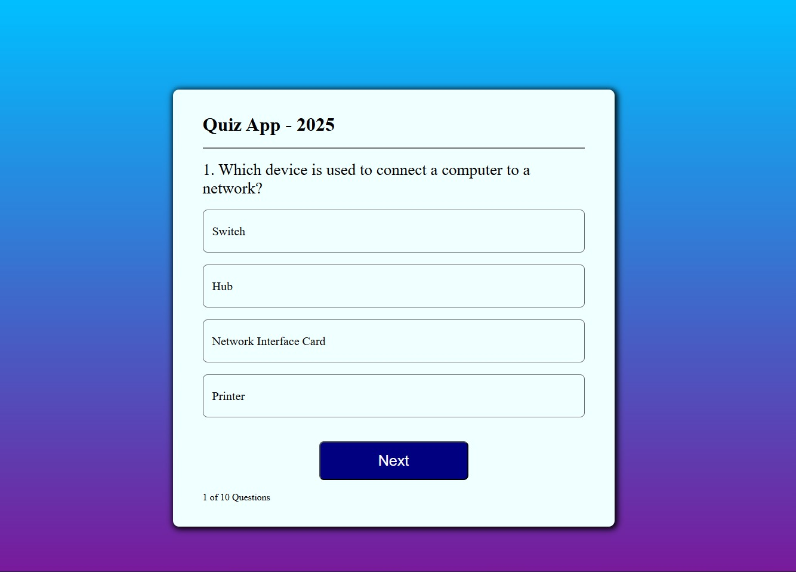

# 📚 ICT Quiz Application

An interactive **ICT Multiple Choice Quiz** built with React.js.  
Test your ICT knowledge with multiple-choice questions, get instant feedback, and view your final score.

---

## 🚀 Features
- **10 ICT-related multiple-choice questions**
- Real-time answer selection
- Final score calculation
- Responsive and modern UI
- Easy-to-edit question data
- Component-based React architecture

---

## 🛠️ Technologies Used
- **React.js** (Vite or Create React App)
- **JavaScript (ES6+)**
- **CSS3** for styling

---
